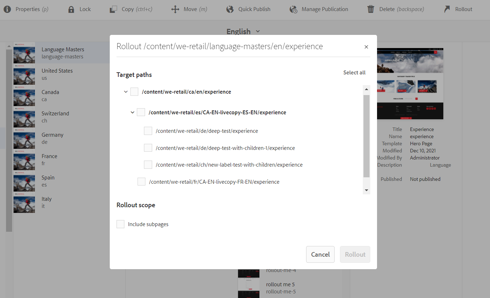
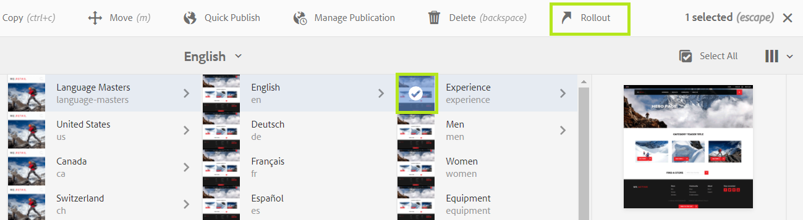
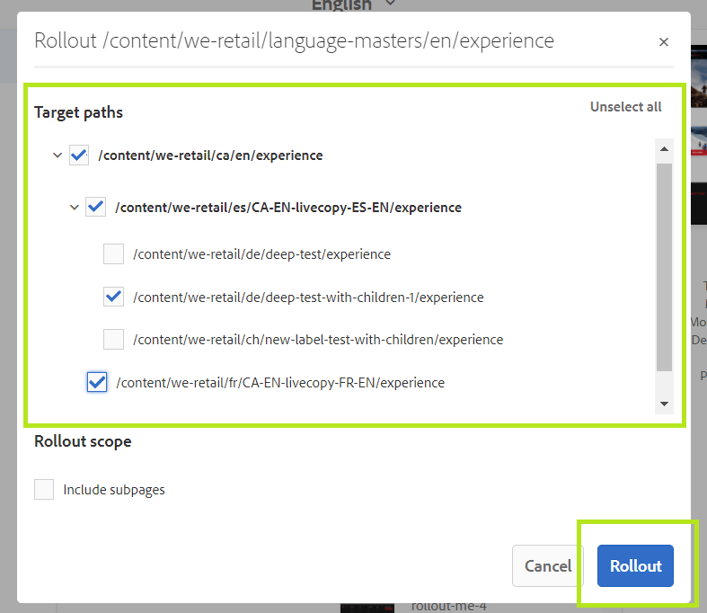
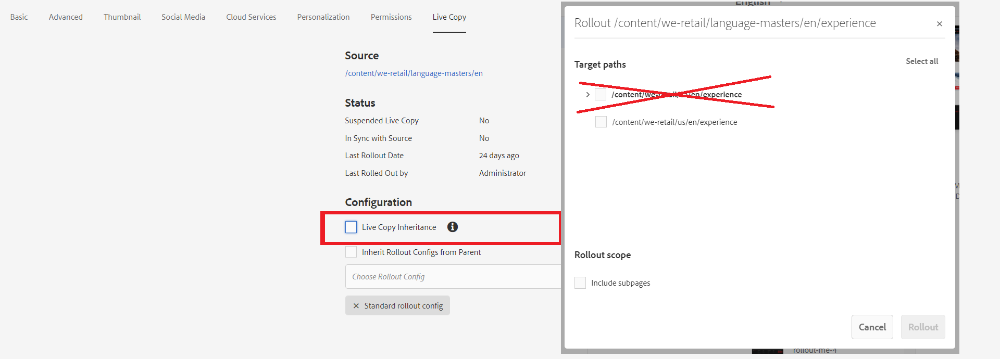

# EToolbox Rollout Manager

**EToolbox Rollout Manager** is a tool for Adobe Experience Manger (AEM) allowing to roll out changes to multiple levels of live relationships simultaneously.

## Description

**EToolbox Rollout Manager** is a comprehensive AEM tool meant for AEM website content managers and QA departments. The Rollout Manager can help users roll out changes and updates across multiple levels of AEM live copies. In other words, users can synchronize content in all necessary live copies simultaneously instead of doing so manually for every individual page. Not only does Exadel Rollout Manager reduce the manual effort needed to apply all changes, but it also presents all updates through a user-friendly interface.

## System Requirements

AEM 6.5 | AEM 6.4 | Java SE | Maven
---------|---------|---------|---------
6.5.5.0+ | 6.4.8.1+ | 8, 11 | 3.3.9+

## Installation
The tool can be installed using the package or via building the project.

### Package
1. Get the latest package version from https://github.com/exadel-inc/etoolbox-rollout-manager/releases
2. Install the package _**etoolbox-rollout-manager.all-XX.zip**_ using the _Package Manager_
3. Ensure that the bundle **_EToolbox Rollout Manager - Core (etoolbox-rollout-manager.core)_** is in _Active_ state.
4. Ensure the nodes **_/content/etoolbox-rollout-manager/servlet_** and **_/apps/wcm/core/content/sites/jcr:content/actions/selection/rollout_** are present.

### How to build

Run the following command in the project root directory to build all the modules and deploy the `all` package to a local instance of AEM:

`mvn clean install -PautoInstallSinglePackage`

## Getting Started
1. Go to _Sites_ and select a page to be rolled out.
   
   
   
2. Click the _Rollout_ button in the action bar.
3. Select target paths and check the _Include subpages_ if necessary, click _Rollout_ in the dialog.
   
   

## Features
### Toolbar button
The _Rollout_ button is added to the _Sites_ action bar:

The button is active if the conditions listed below are satisfied.

#### Button active conditions
- Single selection.
- Selected page has live relationships.
- Parent page of the selected page must exist under at least one live relationship (i.e target) path.

### Loader before the dialog shows
Foundation UI's _wait()_ function is used to show a wait mask before the dialog is loaded. The delay may be caused by collecting target paths and vary depending on the live copies structure complexity.

### Target paths
The list of live relationships is collected recursively for the selected page and transformed to target paths.  First, the live relationships for the current page are fetched, then for each live  relationship the process of fetching is repeated, until relationships for all levels are collected.

#### Exclusions
- If a live copy was created with the property _Exclude sub pages_ enabled, or the live copy the has the property _Live Copy Inheritance_ disabled in page properties, rollout/synchronization for child pages won't be available.
  
  
  
  
  
  Let's suppose there are a blueprint page _/content/we-retail/language-masters/en_ and its child _/content/we-retail/language-masters/en/experience_. The blueprint _/content/we-retail/language-masters/en_ has a live copy _/content/we-retail/ca/en_, and the child's live relationship is _/content/we-retail/ca/en/experience_. Presuming that the live copy _/content/we-retail/ca/en_ has the property _Live Copy Inheritance_ disabled, _/content/we-retail/ca/en/experience_ won't be present in the _Target paths_ for _/content/we-retail/language-masters/en/experience_.
  
  

- If a page is in a live copy exclusions, synchronization of the page won't be available under this live copy path. In the example above if the page _/content/we-retail/ca/en/experience_ is deleted, the path _experience_ will be added to the exclusions set of _/content/we-retail/ca/en_. Thus, _/content/we-retail/ca/en/experience_ won't be present in the _Target paths_ for _/content/we-retail/language-masters/en/experience_.
  
### Nested checkbox tree
The checkbox tree is built based on nested [Coral.Accordion](https://www.adobe.io/experience-manager/reference-materials/6-5/coral-ui/coralui3/Coral.Accordion.html) widgets in conjunction with [Coral.Checkbox](https://www.adobe.io/experience-manager/reference-materials/6-5/coral-ui/coralui3/Coral.Checkbox.html). The tree is scrollable.

#### Checkboxes states
- 3 states for a checkbox if contains children: check itself + check children > check itself + uncheck children > uncheck itself
- 2 states for a checkbox if no children: check > uncheck
- in addition, checking the current checkbox also checks all parent checkboxes, since it shouldn't be possible to rollout child path w/o rolling out parent target paths

#### Select/Unselect all
The button allows to select or unselect all target paths. The button label is changed accordingly (Select all > Unselect all).

#### New label
The _new_ label is shown if a selected page doesn't exist under a target path and will be created during a rollout process.

#### Selection validation
The _Rollout_ button is disabled if no target paths are selected.

### Rollout
#### Include subpages
The option implies rolling out of all child pages along with the selected page to target paths (similarly to the _Rollout page and all sub pages_ OOTB feature).

#### Rollout in progress
The message informing that the rollout process in progress is displayed after clicking the _Rollout_ button.

#### Success/Fail message
The message informing about the rollout process result is displayed after completion.

   
## Contributing

Contributions are what make the open source community such an amazing place to be learn, inspire, and create. Any contributions you make are **greatly appreciated**.

1. Fork the Project
2. Create your Feature Branch (`git checkout -b feature/AmazingFeature`)
3. Commit your Changes (`git commit -m 'Add some AmazingFeature'`)
4. Push to the Branch (`git push origin feature/AmazingFeature`)
5. Open a Pull Request

## License

This project is available under the [Apache License, Version 2.0](https://opensource.org/licenses/Apache-2.0).